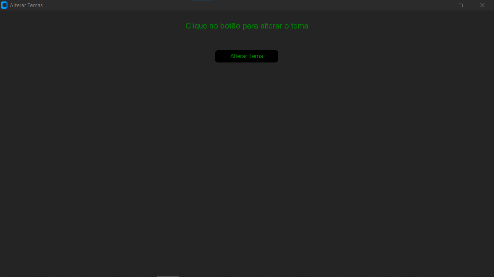
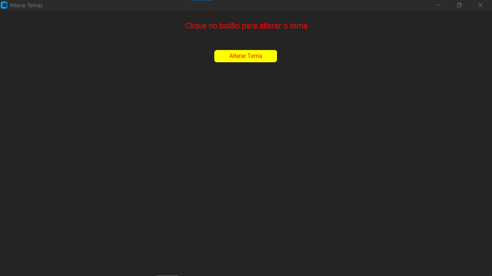
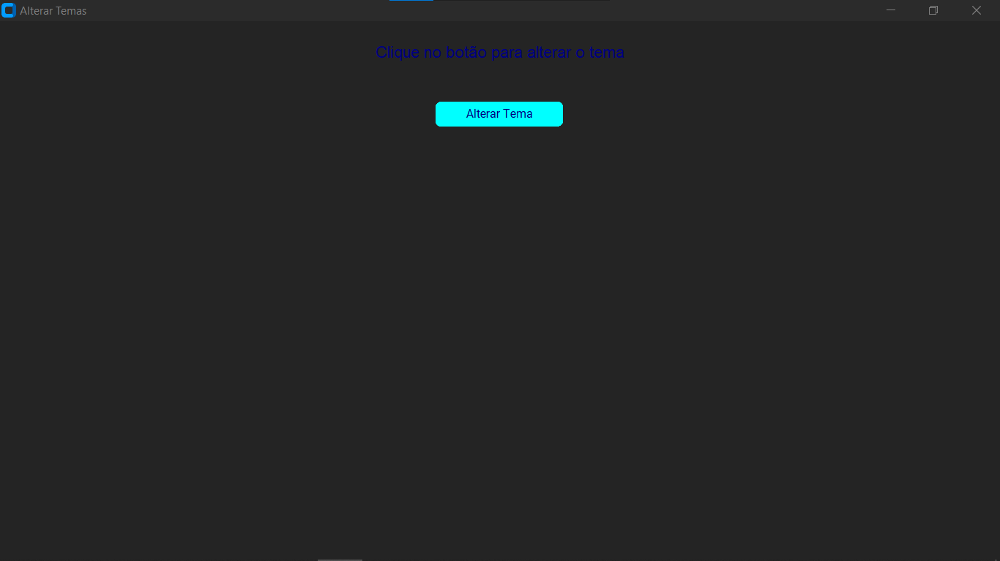
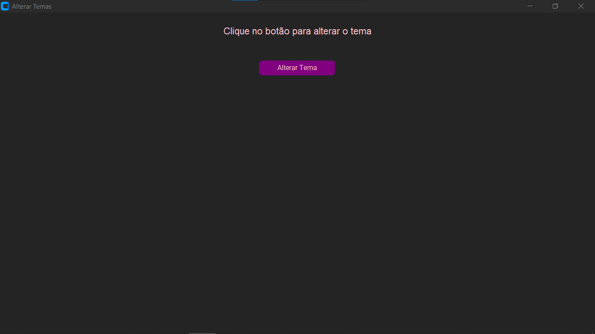

# TEMAS COM CUSTOMTKINTER
👨‍🏫ALTERE O TEMA COM APENAS UM CLIQUE EM UM DOS 10 ESQUEMAS DE CORES DISPONÍVEIS.

 <br>
 <br>
 <br>
 <br>

## DESCRIÇÃO:
Este aplicativo, criado usando CustomTkinter, é uma interface gráfica simples que permite ao usuário alternar entre 10 temas diferentes clicando em um botão. Cada tema é uma combinação única de cores de fundo e de texto, proporcionando uma maneira visualmente atraente de demonstrar a funcionalidade de personalização de interfaces gráficas.

## FUNCIONALIDADES:
- Cada clique no botão "Alterar Tema" aplica um novo conjunto de cores à janela e aos widgets (rótulo e botão).
- O aplicativo percorre ciclicamente uma lista de 10 temas diferentes, mudando a aparência da interface a cada clique.

## EXECUTANDO ESSE PROJETO:
1. Certifique-se de ter as biblioteca customtkinter instalada no seu ambiente Python. Se não tiver, você pode instalá-la usando o pip:
   ```
   pip install customtkinter
   ```

2. Para executar o arquivo Python, utilize o comando abaixo no terminal, dentro do diretório `./CODIGO`:

   ```
   python CODIGO.py
   ```

3. Quando o aplicativo é iniciado, ele aplica automaticamente o primeiro tema da lista.

4. **Interação:**
   - Para alternar o tema, basta clicar no botão "Alterar Tema".
   - A cor de fundo da janela e a cor do texto do rótulo e do botão mudarão para refletir o novo tema.
   - Cada clique no botão aplicará o próximo tema da lista de temas, ciclando de volta ao início após o décimo tema.

## NÃO SABE?
- Entendemos que para manipular arquivos em muitas linguagens, é necessário possuir conhecimento nessas áreas. Para auxiliar nesse aprendizado, oferecemos cursos gratuitos disponíveis:
* [CURSO DE PYTHON](https://github.com/VILHALVA/CURSO-DE-PYTHON)
* [CURSO DE CUSTOMTKINTER](https://github.com/VILHALVA/CURSO-DE-CUSTOMTKINTER)
* [CONFIRA MAIS CURSOS](https://github.com/VILHALVA?tab=repositories&q=+topic:CURSO)

## CREDITOS:
- [PROJETO CRIADO PELO VILHALVA](https://github.com/VILHALVA)


